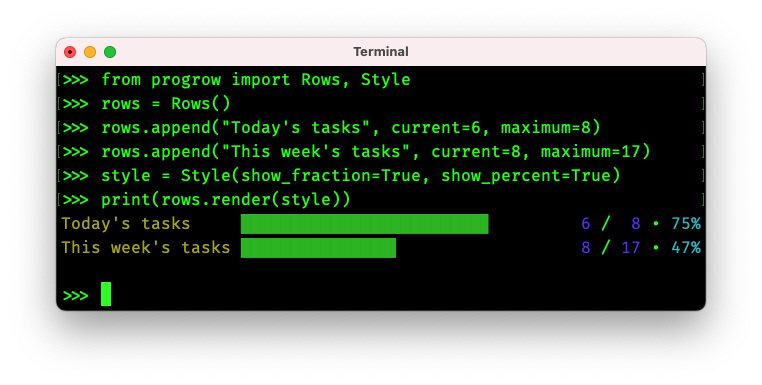

# progrow

`progrow` is a Python package for describing the progress of work across rows.



## Installation

`progrow` requires Python 3.9 or later.

```bash
pip install progrow
```

## Examples

### Rendering a single row

```python
from progrow import Row

row = Row("apple harvest", current=23, maximum=100)
print(row.render())
```

```text
apple harvest ████████▉
```

### Including fractions, percentages and other styles

An optional `Style` can be passed into `render()`:

| Property        | Description                                                      | Default        |
|-----------------|------------------------------------------------------------------|----------------|
| `color`         | Render in colour                                                 | `True`         |
| `name_suffix`   | String to append after each row's name                           | `" "`          |
| `show_fraction` | Include each row's fractional progress (`<current> / <maximum>`) | `False`        |
| `show_percent`  | Include each row's percentage progress                           | `False`        |
| `width`         | Width to draw                                                    | Terminal width |

```python
from progrow import Row, Style

row = Row("apple harvest", current=23, maximum=100)
style = Style(name_suffix=" progress: ", show_fraction=True, show_percent=True)

print(row.render(style=style))
```

```text
apple harvest progress: ███▌            23 / 100 • 23%
```

### Rendering rows from a generator

```python
from progrow import Row, Style

style = Style(show_fraction=True, show_percent=True)

for harvest in harvest_generator():
    row = Row(harvest[0], current=harvest[1], maximum=harvest[2])
    print(row.render(style=style))
```

```text
apple harvest ███                         1 / 9 • 11%
banana harvest ██▍                        9 / 99 • 9%
caramel harvest ███████████████████▉ 100 / 100 • 100%
```

Since the rows are "streaming" in from a generator, the layout cannot be pre-calculated and the columns don't align.

To make this output prettier, create a `Layout` and guesstimate your columns:

| Property                | Description                                                                                             |
|-------------------------|---------------------------------------------------------------------------------------------------------|
| `left_fraction_length`  | Width of the "current" part of the fraction. For example, `3` to accommodate a three-digit value.       |
| `name_length`           | Width of the name column. For example, `10` to accommodate a ten-character name.                        |
| `percent_length`        | Width of the percentage column. For example, `3` to accommodate a two-digit value plus a `%` character. |
| `right_fraction_length` | Width of the "maximum" part of the fraction. For example, `3` to accommodate a three-digit value.       |

```python
from progrow import Layout, Row, Style

layout = Layout(
    left_fraction_length=3,
    name_length=16,
    percent_length=4,
    right_fraction_length=3,
)

style = Style(show_fraction=True, show_percent=True)

for harvest in harvest_generator():
    row = Row(harvest[0], current=harvest[1], maximum=harvest[2])
    print(row.render(layout, style))
```

```text
apple harvest    ██▏                   1 /   9 •  11%
banana harvest   █▊                    9 /  99 •   9%
caramel harvest  ███████████████████ 100 / 100 • 100%
```

### Rendering rows from a list

When all the row data is available before rendering, create a `Rows` instance to have the layout calculated automatically.

```python
from progrow import Rows, Style

rows = Rows()
rows.append("apple harvest", current=1, maximum=9)
rows.append("banana harvest", current=9, maximum=99)
rows.append("caramel harvest", current=100, maximum=100)

style = Style(show_fraction=True, show_percent=True)

print(rows.render(style))
```

```text
apple harvest   ██▎                    1 /   9 •  11%
banana harvest  █▊                     9 /  99 •   9%
caramel harvest ███████████████████▉ 100 / 100 • 100%
```

## Thank you! 🎉

My name is **Cariad**, and I'm an [independent freelance DevOps engineer](https://cariad.io).

I'd love to spend more time working on projects like this, but--as a freelancer--my income is sporadic and I need to chase gigs that pay the rent.

If this project has value to you, please consider [☕️ sponsoring](https://github.com/sponsors/cariad) me. Sponsorships grant me time to work on _your_ wants rather than _someone else's_.

Thank you! ❤️
